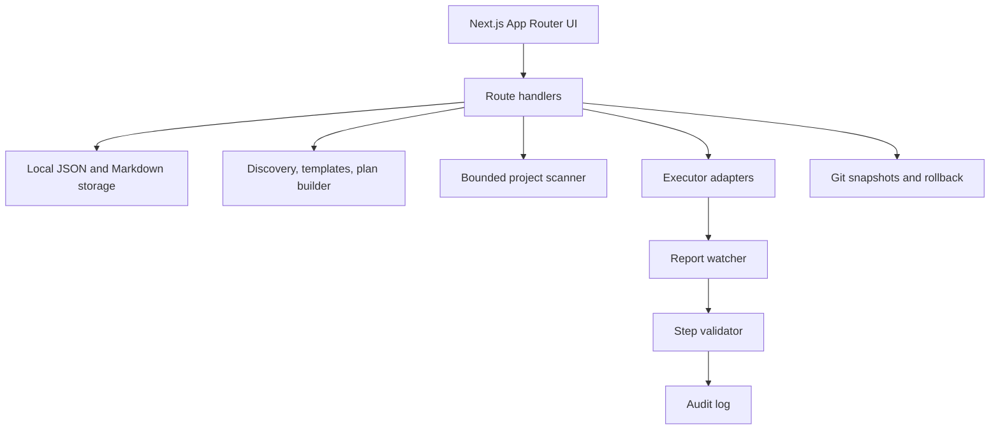

# PlanGraph

Local-first project planning with executable per-step Markdown plans.


## Features

- Guided onboarding for experience level, tools, language, and communication style.
- Idea discovery that asks clarifying questions without calling external AI APIs.
- Template-based project generation for common app types.
- Per-step Markdown files with goals, context, libraries, prompts, and success criteria.
- Vertical React Flow box graph for project structure.
- Step viewer with status updates and executor prompts.
- Memory Bank that captures decisions, conventions, issues, and file maps.
- Executor preparation for Manual, Claude Code, Cursor, and Antigravity workflows.
- Dashboard with project list, progress, recent activity, snapshots, and audit views.
- Existing-project importer that scans a folder and generates a remaining-work plan.

## Quick Start

```bash
npm install
npm run dev
```

Open http://localhost:3000. PlanGraph is intended to run locally only.

## How It Works

PlanGraph stores user data under `workspace/`, builds a typed project model from either a new idea or an imported folder scan, writes human-readable Markdown artifacts, and lets the user execute one step at a time with their preferred local coding tool. Reports, snapshots, validation checks, memory entries, and audit events keep the plan grounded in what actually happened.

## Architecture



## Security Notes

PlanGraph is localhost-only, uses guarded path resolution for managed workspace files, avoids external AI API calls, and redacts common secret patterns in user-facing logs. See [docs/SECURITY.md](docs/SECURITY.md) for the threat model.

## Roadmap

- VS Code extension.
- MCP server for richer local tool integrations.
- More project templates and import heuristics.
- Exportable progress reports.
- Real screenshots and release assets.

## Contributing

Keep changes local-first, bounded, and testable. Run `npm run test` and `npm run build` before opening a pull request.

## License

MIT. See [LICENSE](LICENSE).
