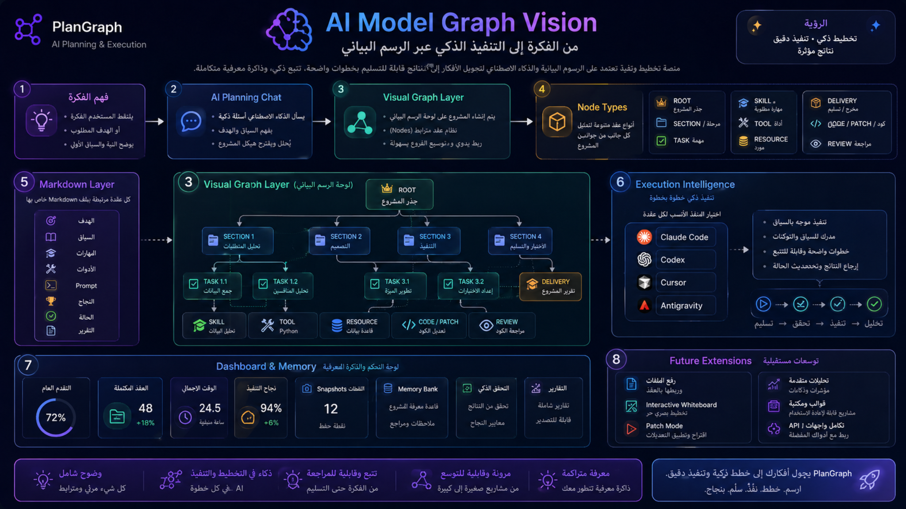
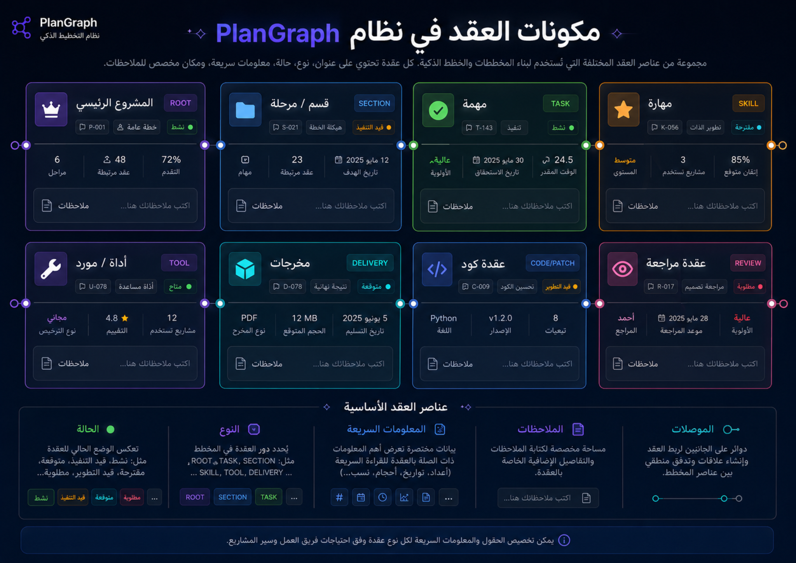

# AI Model Graph Vision

## One-line Vision

PlanGraph turns an idea into a visual execution graph, where every node has meaning, every step has a Markdown file, and every action can be executed with the AI tool the user already uses.

## Core Principle

PlanGraph is not a replacement for Claude Code, Codex, Cursor, Antigravity, or other execution tools. It is the planning, context, and coordination layer around them.

> Plan once. Execute step by step. Use any AI tool. Never lose context.

## Visual Reference

## Product Layers

### 1. Idea Understanding Layer

The user describes the project in natural language. The system helps clarify:

- The project goal
- The target user
- Technical constraints
- Expected deliverables
- Required skill level
- Preferred tools

Visual references:

- `assets/03-ai-planning-chat-v1.png`
- `assets/11-ai-planning-chat-v2.png`

### 2. AI Planning Chat Layer

The assistant asks questions, summarizes answers, recommends structure, and prepares a plan. This layer can be implemented later using local models, BYOK, or manual planning. In MVP 2, it is documented and designed. In MVP 3, it becomes active.

### 3. Visual Graph Layer

The project is represented as a graph of nodes. Each node can represent:

- Root project idea
- Section or phase
- Task
- Skill
- Tool or resource
- Deliverable
- Code/Patch action
- Review step

Visual references:

- `assets/04-graph-workspace-v1.png`
- `assets/09-graph-workspace-v2.png`
- `assets/06-ai-model-graph-map.png`

### 4. Node System

Each node should have consistent data:

- ID
- Type
- Title
- Status
- Description
- Skills
- Libraries
- Tools
- Prompt
- Success criteria
- Notes
- Report

Visual reference:

## Node Types

| Type | Meaning |
|---|---|
| ROOT | Main project idea or root objective |
| SECTION | A major project phase or branch |
| TASK | A concrete implementation task |
| SKILL | A required ability or concept |
| TOOL | A tool, platform, or library needed for execution |
| RESOURCE | A source, file, dataset, or external reference |
| DELIVERY | A final output or deliverable |
| CODE/PATCH | A targeted code creation or modification node |
| REVIEW | A validation, review, or QA node |

## Markdown Layer

Every meaningful node should map to a Markdown file. This is the core of PlanGraph because it preserves context outside the AI chat.

A node Markdown file should include:

- Goal
- Context
- Required skills
- Suggested libraries
- Suggested tools
- Execution prompt
- Success criteria
- Restrictions
- User notes
- Status
- Execution report

Visual reference:

- `assets/13-library-memory.png`

## Execution Intelligence Layer

Execution should happen step by step. The user selects the executor:

- Claude Code
- Codex
- Cursor
- Antigravity
- Manual

PlanGraph prepares the correct prompt and context for the selected tool.

Visual references:

- `assets/05-execution-center-v1.png`
- `assets/12-execution-center-v2.png`

## Dashboard and Memory Layer

The dashboard gives the user confidence and orientation:

- What is completed?
- What is active?
- What is blocked?
- What changed recently?
- What is the next step?
- What did the project remember?

Visual references:

- `assets/01-dashboard-overview-v1.png`
- `assets/08-dashboard-overview-v2.png`

## Safety and Control

PlanGraph should prioritize user control:

- Snapshot before risky changes
- Import without destroying existing code
- Validation after steps
- Audit trail for important changes
- Protected files and local-first behavior

Visual references:

- `assets/14-snapshots-import.png`
- `assets/15-validation-audit-reports.png`
- `assets/16-settings-workspace.png`

## MVP 2 vs MVP 3

MVP 2 establishes the complete product vision and visual structure.

MVP 3 adds deeper intelligence and automation.

## Final Direction

PlanGraph should feel like a calm command center for building projects with AI. The user should always know:

- What the project is
- Where they are
- What each step means
- Which tool will execute it
- What happened after execution
- What should happen next
